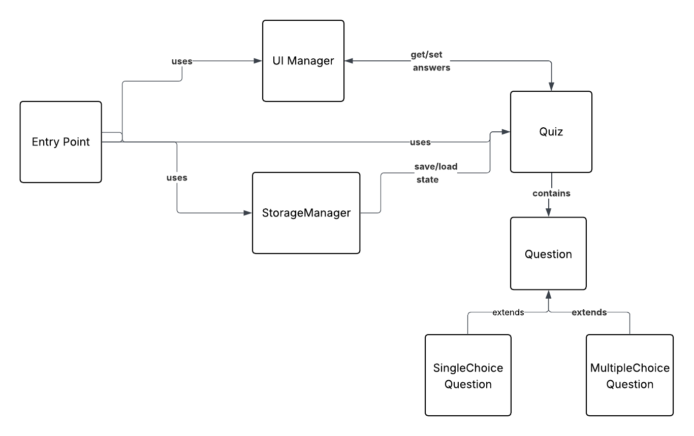

## Quiz App Technical requirements:

## Folder Structure:

**mock/**

- `questions.js` - questions array

**modules/**

- `Question.js` — Base class for all question types
- `MultipleChoiceQuestion.js` — Multiple Choice Question with checkboxes (extends `Question`)
- `SingleChoiceQuestion.js` — Single Choice Question with radio buttons (extends `Question`)
- `Quiz.js` — Handles quiz state, questions, and score
- `StorageManager.js` — Manages Local Storage interactions
- `UIManager.js` — DOM manipulation and rendering logic

**root/**

- `index.html`
- `style.css`
- `script.js`
- `TECH.md` — Technical Requirements
- `diagram.png` - Project diagram
- `utils.js` - Utility functions for theme management, UI state, event handling, and app initialization

### Requirements:

#### App Approach:

- Use JavaScript ES6+ classes
- Follow Object-Oriented Programming (OOP) principles
- Persist quiz state with Local Storage
- Load all questions at once
- **Multiple Choice Questions**: Allow multiple answers using checkboxes
- **Single Choice Questions**: Allow only one answer using radio buttons
- **Submit button**:
  - Saves selected answers
  - Calculates and displays the score
  - Hides questions and buttons, shows only score/feedback
- **Reset button**:
  - Clears all answers
  - Resets quiz state
  - Shows questions and buttons again
- Display score and feedback after submission
- After submission, user can reload to start a new attempt

---

#### App Flow: Based on User Stories

**1. Load Questions**

- Retrieve all questions from an array of objects
- For each question:
  - Use its `displayQuestion()` method to generate DOM options
  - Multiple choice questions use checkboxes (multiple answers)
  - Single choice questions use radio buttons (single answer)
  - Supports multiple-choice (MCQ) and single-choice (SCQ) types
- At least **10 questions** required (mixed types)
- On initial load:
  - Render all questions in the DOM
  - If no previous submission exists, restore answers from Local Storage
  - If submitted or new, start with empty answers

**2. Select Answer**

- Each selection updates answers both in UI and Local Storage:
  - For radio buttons: single value selection
  - For checkboxes: array of selected values
  - The UI gets the answers from the Quiz by recordAnswer()
  - The localStorage saves the selectedQuestions by saveState()
  - The UI reflects the updated selection

**3. Reset Quiz**

- Reset button actions:
  - Clear answers
  - Clear Local Storage
  - Initialize new quiz state in Local Storage
  - Display questions with no selections
  - Show questions and buttons again

**4. Submit Quiz**

- Submit button actions:
  - Save selected answers
  - Run `calculateScore()`
  - Hide questions and buttons
  - Display final score and feedback only
  - Show pass/fail feedback (`Pass ≥ 70%`)
  - Clear Local Storage for the next attempt

**5. Refresh Page**

- On reload:
  - If an active attempt exists → restore answers
  - If no active attempt or previous submission → start a fresh quiz

---

## Classes: Technical details

### Question (Base Class)

- Properties:

  - `id`
  - `text`
  - `options`
  - `correctAnswer` (can be string or array)
  - `userAnswer` (can be string or array)

- Methods:
  - `displayQuestion()`: generates question in the DOM
  - `checkAnswer(answer)`: returns true if answer matches correctAnswer (handles both single and multiple answers)

### MultipleChoiceQuestion (extends Question)

- Properties: Inherits from Question
- Methods:
  - `displayQuestion()`: (Override) generates multiple-choice options with checkboxes in the DOM
  - Allows multiple answers to be selected

### SingleChoiceQuestion (extends Question)

- Properties: Inherits from Question
- Methods:
  - `displayQuestion()`: (Override) generates single-choice options with radio buttons in the DOM
  - Allows only one answer to be selected

### Quiz

- Properties:

  - `questions[]`
  - `answers` (object with questionId as key, answer/answers as value)
  - `score`
  - `attemptActive`

- Methods:
  - `loadQuestions(questionData)`: initializes questions
  - `recordAnswer(questionId, answer)`: updates answers (handles both single values and arrays)
  - `calculateScore()`: counts correct answers
  - `isComplete()`: checks if all questions are answered (at least one option for multiple choice)

### StorageManager

- Properties:

  - `#key`

- Methods:
  - `saveState(quizState)`: stores quiz state in localStorage
  - `loadState()`: retrieves quiz state
  - `clearState()`: clears quiz state

### UiManager

- Methods:
  - `displayAllQuestions()`: renders all questions
  - `updateSelection()`: updates UI on selection
  - `showScore()`: displays score
  - `showFeedback()`: displays pass/fail message
  - `resetUI()`: clears selections and shows questions again

### Class Relationships

- Question (Base Class)

  - Parent class for all question types
  - Provides shared properties and methods
  - Handles both single and multiple answer validation

- MultipleChoiceQuestion

  - Inherits from Question
  - Overrides displayQuestion() to render checkboxes
  - Supports multiple answer selection

- SingleChoiceQuestion

  - Inherits from Question
  - Overrides displayQuestion() to render radio buttons
  - Supports single answer selection

- Quiz

  - Contains an array of Question objects
  - Manages quiz state and scoring
  - Handles both single and multiple answer types

- StorageManager

  - Handles persistence of quiz state in localStorage

- UiManager
  - Responsible for rendering and DOM manipulation
  - Handles both checkbox and radio button interactions

#### Interactions:

- Quiz controls the logic, StorageManager for persistence, and UiManager for rendering
- Quiz contains Question objects (MultipleChoiceQuestion or SingleChoiceQuestion)
- UiManager displays questions and updates based on user actions
- StorageManager ensures quiz progress is saved and restored
- After submission, only score/feedback is shown until reload

#### Diagram:

